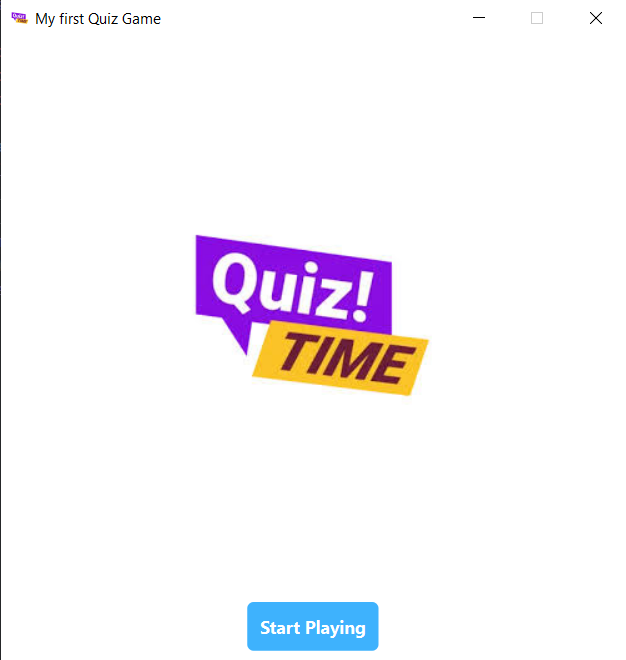
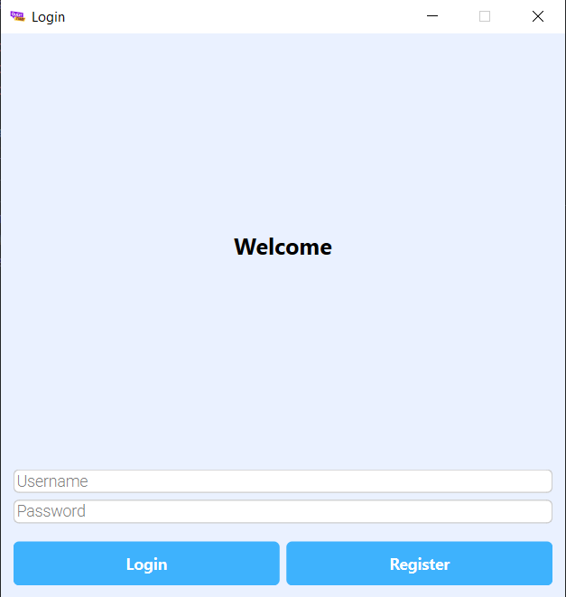
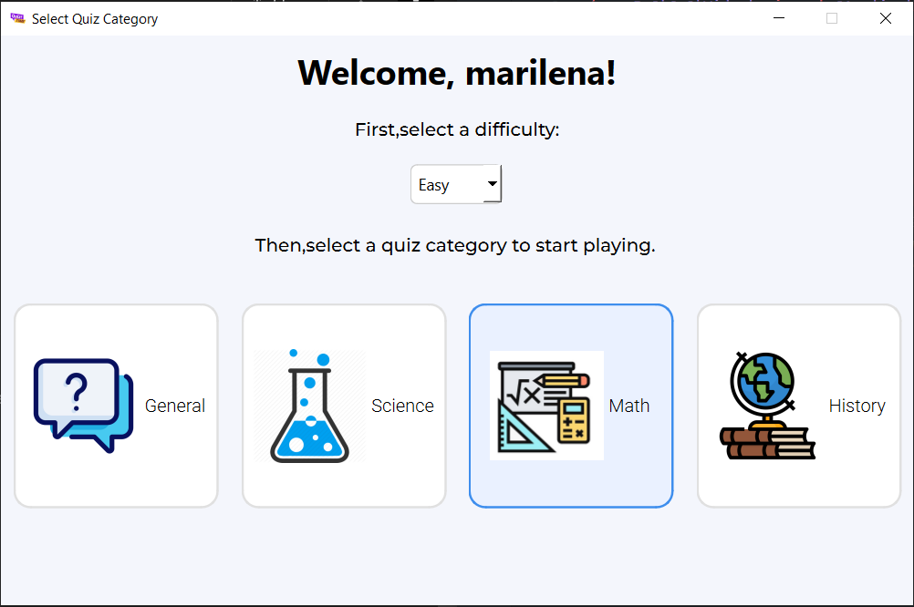
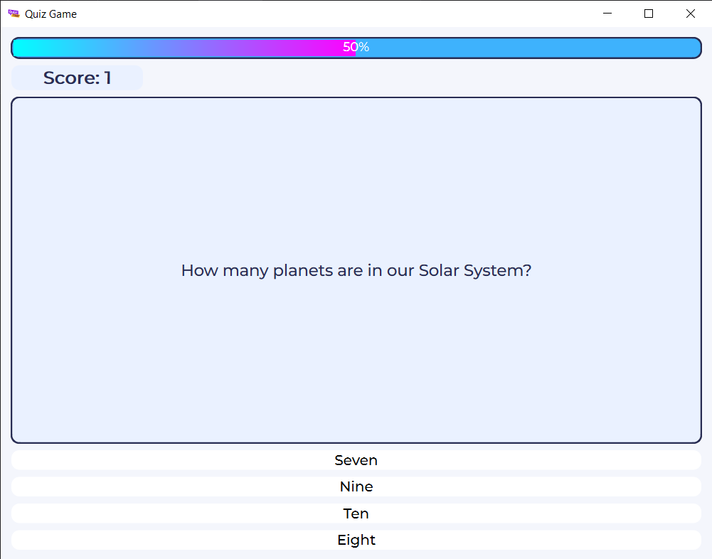
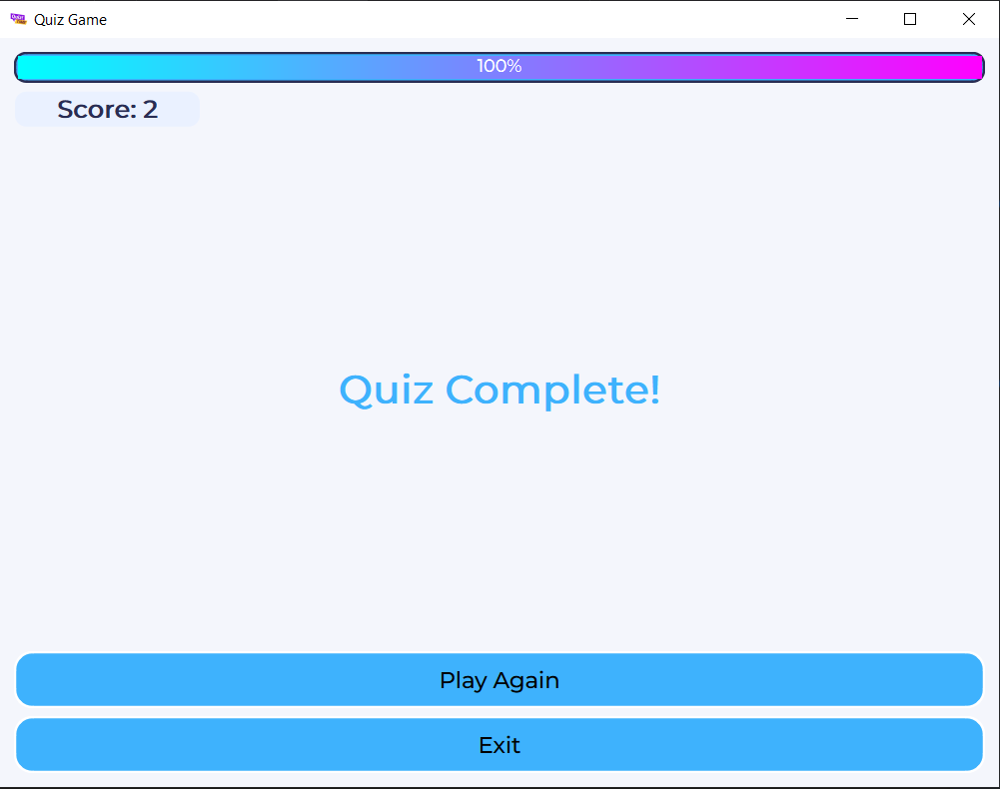

This project implements interactive desktop quiz application built with Python,PyQt6 and TinyDB, using real-time questions from the Open Trivia Database.
It features a modern UI, tracks scores, and allows users to select categories and difficulty levels.

### Preview

### Home Page

### Login Page

### Main Menu

### Quiz Screen

### Quiz Complete

