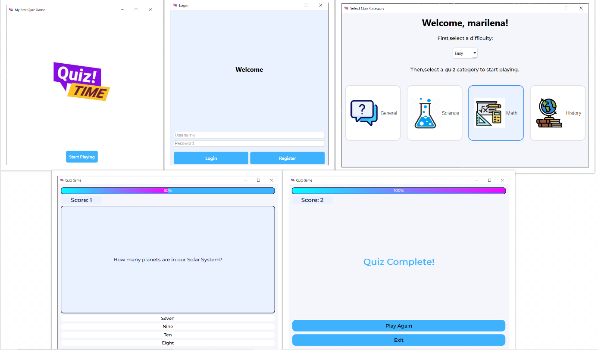
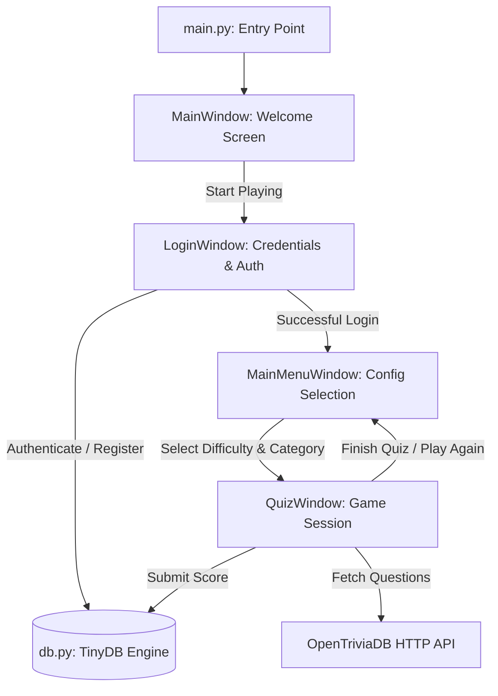

# Quiz Game

This project implements interactive desktop quiz application built with Python,PyQt6 and TinyDB, using real-time questions from the Open Trivia Database.

---

##  Features

*   **Secure Authentication System:** Simple user registration and credentials validation, querying local JSON tables.
*   **Dynamic Trivia Generation:** Fetches trivia from the **Open Trivia Database API** directly over HTTPS requests.
*   **Category & Difficulty Filters:** Custom selection dashboards allowing easy, medium, or hard difficulties across categories: General Knowledge, Science & Nature, Mathematics, and History.
*   **Aesthetic UI/UX:** Styled using PyQt6 stylesheets, responsive window transitions, smooth custom linear-gradient progress bars, and hover animations.
*   **Scores History & Persistence:** Auto-saved score details mapped with timestamp, category, and username via a lightweight file-based TinyDB engine.

---

##  Technologies Used

[](https://www.python.org/)
[](https://www.qt.io/)
[](https://tinydb.readthedocs.io/)
[](https://opentdb.com/)

## Visual Preview


## System Architecture

The project implements a clean window-transition routing logic:


```mermaid
graph TD
    A[main.py: Entry Point] --> B[MainWindow: Welcome Screen]
    B -->|Start Playing| C[LoginWindow: Credentials & Auth]
    C -->|Authenticate / Register| DB[(db.py: TinyDB Engine)]
    C -->|Successful Login| D[MainMenuWindow: Config Selection]
    D -->|Select Difficulty & Category| E[QuizWindow: Game Session]
    E -->|Fetch Questions| API[OpenTriviaDB HTTP API]
    E -->|Submit Score| DB
    E -->|Finish Quiz / Play Again| D
```

---

## Project Structure

```bash
QuizGame/
│
├── Assets/                        # Design elements and assets
│   ├── Screenshots/               # Gameplay & interface previews
│   ├── static/                    # Custom application TTF fonts
│   ├── general.png                # Category Icons
│   └── Quiz.jpg                   # Main window branding/logo
│
├── main.py                        # Main executable launching QApplication
├── MainWindow.py                  # Landing screen UI window
├── LoginWindow.py                 # Handles register/login credentials UI
├── MainMenuWindow.py              # Selects difficulty and trivia categories
├── QuizWindow.py                  # Questions engine (HTTP API + Scoring UI)
│
├── db.py                          # TinyDB setup and CRUD queries
├── button_styling.py              # Shared PyQt CSS styles for buttons
│
├── users.json                     # TinyDB local table: Registered accounts
└── scores.json                    # TinyDB local table: High score logs
```

---

## Installation & Setup

Ensure you have **Python 3.8+** installed. Then follow these steps to run the game locally:

### 1. Clone the Repository
```bash
git clone https://github.com/marilenakosma/QuizGame.git
cd QuizGame
```

### 2. Configure a Virtual Environment
```bash
# Create a virtual environment
python -m venv .venv

# Activate it (Windows)
.venv\Scripts\activate

# Activate it (macOS/Linux)
source .venv/bin/activate
```

### 3. Install Dependencies
```bash
pip install PyQt6 requests tinydb
```

### 4. Run the Game
```bash
python main.py
```

---

## Data Management Schema

The project stores persistent data in flat JSON files managed via [TinyDB](https://tinydb.readthedocs.io/).

### Users Table (`users.json`)
```json
{
  "_default": {
    "1": {
      "username": "myuser",
      "password": "mypassword"
    }
  }
}
```

### Scores Table (`scores.json`)
```json
{
  "_default": {
    "1": {
      "username": "myuser",
      "score": 8,
      "category": "Math",
      "date": "2026-05-24 18:14:00"
    }
  }
}
```

---

> [!NOTE]
> **API Dependencies**
> The quiz fetches questions dynamically from [Open Trivia DB](https://opentdb.com/). Ensure you have an active internet connection when launching a game session.

> [!IMPORTANT]
> **HTTPS Security Note**
> If your network requires a proxy or SSL certificate validation, ensure your Python installation's `requests` package has access to system certificates.

---

## License

Distributed under the MIT License. See `LICENSE` for more information.


