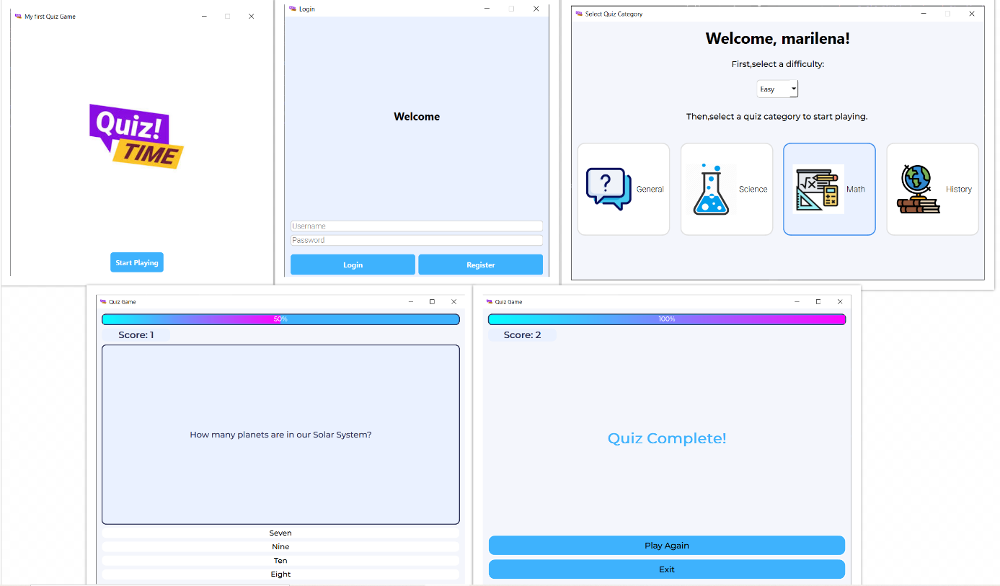

This project implements interactive desktop quiz application built with Python,PyQt6 and TinyDB, using real-time questions from the Open Trivia Database.
It features a modern UI, tracks scores, and allows users to select categories and difficulty levels.

## 🔧 Installation

```bash
git clone https://github.com/marilenakosma/QuizGame.git
cd quizgame

python -m venv venv
source venv/bin/activate  # On Windows use: venv\Scripts\activate

pip install PyQt6 requests tinydb

python main.py

```

### Preview


### Home Page


### Login Page


### Main Menu


### Quiz Screen


### Quiz Complete


